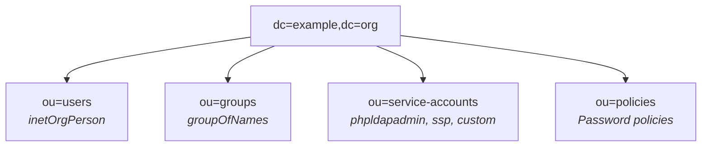

# OpenLDAP docker setup

A streamlined way to deploy an **[OpenLDAP](https://openldap.org/)** server along with **[phpLDAPadmin](https://github.com/leenooks/phpLDAPadmin)** and **[Self Service Password](https://github.com/ltb-project/self-service-password)** using Docker Compose. Built on the minimal [cleanstart/openldap](https://hub.docker.com/r/cleanstart/openldap) image (OpenLDAP 2.6).

## Key features

- **Minimal image**: Uses `cleanstart/openldap` — no shell, no bootstrap scripts, full control via `slapadd`
- **Secure by default**: Least-privilege ACLs per OU, SSHA-hashed rootDN passwords, ECDSA P-384 TLS certificates, isolated Docker network
- **Pre-configured overlays**: memberof, referential integrity, password policy, dynamic lists
- **Service accounts**: Dedicated OU with per-account ACL injection via scripts
- **POSIX optional**: POSIX support (posixAccount/shadowAccount) available via opt-in flag
- **Administration scripts**: Manage users, groups, and service accounts from the command line

## Architecture



### ACL matrix (least privilege)

**Main database** (`dc=example,dc=org`):

| Identity         | userPassword | service-accounts | users | groups | policies | base DN |
| ---------------- | ------------ | ---------------- | ----- | ------ | -------- | ------- |
| self             | write        | -                | write | -      | -        | -       |
| admin (ou=users) | write        | write            | write | write  | read     | write   |
| adminconfig      | -            | -                | read  | -      | -        | -       |
| ssp              | write        | -                | -     | -      | read     | -       |
| phpldapadmin     | -            | -                | read  | read   | read     | -       |
| anonymous        | auth only    | -                | -     | -      | read     | read    |

**Infrastructure databases**:

| Identity    | cn=config | cn=accesslog | cn=Monitor |
| ----------- | --------- | ------------ | ---------- |
| adminconfig | manage    | read         | read       |
| *           | -         | -            | -          |

Users and applications that need read access to `ou=users` or `ou=groups` must use a dedicated service account (see [Service accounts](#service-accounts)).

## Deployment modes

Pick the layout that matches your availability needs. Each mode is self-contained in its own directory.

| Mode | Directory | Topology | Writes | Read scaling | Use when |
|------|-----------|----------|--------|--------------|----------|
| **Standalone** | [`standalone/`](standalone/) | 1 OpenLDAP container | local only | n/a | dev / single-host prod |
| **HA Active-Passive** | [`ha-active-passive/`](ha-active-passive/) | 2 masters (MirrorMode) + N consumers + HAProxy `first` | active master only | consumer replicas | clean failover, no conflict risk |
| **HA Active-Active** | [`ha-active-active/`](ha-active-active/) | N masters (N-way Multi-Master) + HAProxy `roundrobin` | any node | any node | max availability, write throughput |

```bash
# Standalone
cd standalone && bash setup.sh

# HA Active-Passive — boot 3-VM test cluster
cd ha-active-passive/tests && vagrant up

# HA Active-Active — boot 3-VM test cluster
cd ha-active-active/tests && vagrant up
```

Each HA mode boots a 3-VM VirtualBox cluster (`192.168.58.10-12`) running Docker + OpenLDAP 2.6 + HAProxy. See per-mode READMEs for details:

- [standalone/README.md](standalone/README.md)
- [ha-active-passive/README.md](ha-active-passive/README.md)
- [ha-active-active/README.md](ha-active-active/README.md)

## Prerequisites

- Docker & Docker Compose
- `ldap-utils` (`ldapsearch`, `ldapadd`, `ldapmodify`, `ldapdelete`)
- `pwgen` (for admin scripts password generation)
- VirtualBox + Vagrant (HA modes only — for the test cluster)

## Default credentials

| Identity | DN | Password |
|----------|----|----------|
| Admin user (subject to ACLs) | `cn=admin,ou=users,dc=example,dc=org` | `adminpassword` |
| Config admin (rootDN) | `cn=adminconfig,cn=config` | `adminpasswordconfig` |
| Data rootDN | `cn=admin,dc=example,dc=org` | (SSHA-hashed in `slapd-config.ldif`) |
| Replicator (HA only) | `cn=replicator,ou=service-accounts,dc=example,dc=org` | `replicatorpassword` |

> **Change all defaults before production use.** See [Password rotation](#password-rotation) below.

## Project layout

```mermaid
graph LR
    root["."]
    root --> standalone["standalone/<br/><i>mono-instance</i>"]
    root --> hap["ha-active-passive/<br/><i>MirrorMode + consumer</i>"]
    root --> haa["ha-active-active/<br/><i>N-way Multi-Master</i>"]
    root --> shared["Shared resources"]

    shared --> common["common.sh"]
    shared --> s02["create-users.sh"]
    shared --> s03["change-user-password.sh"]
    shared --> s04["delete-users.sh"]
    shared --> s05["create-group.sh"]
    shared --> s06["add-service-account.sh"]
    shared --> s07["change-service-account-password.sh"]
    shared --> s08["delete-service-account.sh"]
    shared --> initl["base-ldifs/<br/><i>base directory data (users, groups, ppolicy)</i>"]

    standalone --> sa_compose["docker-compose.yml"]
    standalone --> sa_setup["setup.sh"]
    standalone --> sa_cfg["init-config/slapd-config.ldif"]
    standalone --> sa_ssp["ssp.conf.php"]
    standalone --> sa_certs["certs.sh + certs/"]
    standalone --> sa_backup["backup/"]

    hap --> hp_compose["docker-compose.yml"]
    hap --> hp_setup["setup-node.sh"]
    hap --> hp_cfg["init-config/<br/>slapd-config.ldif.tmpl"]
    hap --> hp_ildifs["init-ldifs/replicator.ldif"]
    hap --> hp_haproxy["haproxy/haproxy.cfg.tmpl"]
    hap --> hp_env[".env.example"]
    hap --> hp_certs["certs.sh + certs/"]
    hap --> hp_backup["backup/"]
    hap --> hp_tests["tests/<br/><i>Vagrantfile + provision.sh<br/>+ test-replication.sh</i>"]

    haa --> ha_compose["docker-compose.yml"]
    haa --> ha_setup["setup-node.sh"]
    haa --> ha_cfg["init-config/<br/>slapd-config.ldif.tmpl"]
    haa --> ha_ildifs["init-ldifs/replicator.ldif"]
    haa --> ha_haproxy["haproxy/haproxy.cfg.tmpl"]
    haa --> ha_env[".env.example"]
    haa --> ha_certs["certs.sh + certs/"]
    haa --> ha_backup["backup/"]
    haa --> ha_tests["tests/<br/><i>Vagrantfile + provision.sh<br/>+ test-replication.sh</i>"]
```



## Password rotation

```bash
# Change admin user password (cn=admin,ou=users) — uses the admin scripts
bash change-user-password.sh admin

# Change a rootDN password (cn=adminconfig,cn=config OR cn=admin,dc=example,dc=org)
docker run --rm --entrypoint slappasswd cleanstart/openldap:2.6.13 -s "NEW_PASSWORD"
ldapmodify -x -H ldap://localhost:389 -D "cn=adminconfig,cn=config" -w "adminpasswordconfig" <<EOF
dn: olcDatabase={0}config,cn=config
changetype: modify
replace: olcRootPW
olcRootPW: {SSHA}PASTE_HASH_HERE
EOF
```

> After changing the config admin password, update `CONFIG_ADMIN_PASS` in `common.sh`.

## Administration scripts

Run these from the **repo root**. They connect to `ldap://localhost:389` by default (override `LDAP_HOST`/`LDAP_PORT` in `common.sh` if your deployment is elsewhere — e.g. target a specific HA node).

All scripts source `common.sh` for shared configuration (`set -euo pipefail`, LDAP connection, helpers). Passwords are never passed via `-w` on the command line (uses `-y` with temp files). Temp files are cleaned up on exit via `trap`.

All scripts use `cn=admin,ou=users,dc=example,dc=org` (subject to ACLs, not the rootDN).

Passwords are generated with `pwgen -s -y -r '#<>\ "'"'"' 32` (32 chars, symbols, LDIF-safe).

### Create users

Usernames must follow the `firstname.lastname` pattern. The script auto-populates `cn`, `sn`, `givenName`, `displayName`, and `mail`.

```bash
# Standard (inetOrgPerson only)
bash create-users.sh john.doe jane.smith --group=demo

# With POSIX attributes (requires nis schema enabled in slapd-config.ldif)
bash create-users.sh john.doe jane.smith --group=demo --posix
```

### Change user password

```bash
bash change-user-password.sh john.doe
```

### Delete users

Automatically removes the user from all groups before deletion:

```bash
bash delete-users.sh john.doe jane.smith
```

### Create group

At least one member is required (`groupOfNames` schema constraint):

```bash
bash create-group.sh groupName john.doe jane.smith
```

### Service accounts

Create a service account with specific access rights. The script creates the account in `ou=service-accounts` and injects the access rule into the existing ACL for the target subtree:

```bash
# Read access to ou=users
bash add-service-account.sh gitea --access read --subtree "ou=users,dc=example,dc=org"

# Write access to ou=groups
bash add-service-account.sh myapp --access write --subtree "ou=groups,dc=example,dc=org"
```

Change password:

```bash
bash change-service-account-password.sh gitea
```

Delete (also cleans up ACL references):

```bash
bash delete-service-account.sh gitea
```

## POSIX support

POSIX attributes (`posixAccount`, `shadowAccount`, `uidNumber`, `gidNumber`, `homeDirectory`, `loginShell`) are **disabled by default**.

To enable POSIX support, uncomment these lines in your mode's slapd-config (`standalone/init-config/slapd-config.ldif` or `<ha-mode>/init-config/slapd-config.ldif.tmpl`) **before running the bootstrap** (`standalone/setup.sh` or `<ha-mode>/setup-node.sh`):

```ldif
# Schema
#include: file:///etc/openldap/schema/nis.ldif

# Index
#olcDbIndex: uidNumber,gidNumber eq

# ACL (insert as {1}, shift subsequent indexes)
#olcAccess: {1}to attrs=shadowLastChange by self write by * read
```

Then use `--posix` when creating users:

```bash
bash create-users.sh john.doe --posix
```

## TLS / LDAPS

`certs.sh` and `certs/` live inside each deployment mode. Steps below are run from your mode directory (`standalone/`, `ha-active-active/`, or `ha-active-passive/`):

1. Generate certificates:

```bash
cd <mode>            # standalone | ha-active-active | ha-active-passive
bash certs.sh
```

2. Uncomment the TLS lines in your mode's slapd-config (`init-config/slapd-config.ldif` for standalone, `init-config/slapd-config.ldif.tmpl` for HA), inside the `cn=config` entry:

```ldif
olcTLSCACertificateFile: /etc/openldap/certs/openldapCA.crt
olcTLSCertificateFile: /etc/openldap/certs/openldap.crt
olcTLSCertificateKeyFile: /etc/openldap/certs/openldap.key
olcTLSVerifyClient: never
```

3. Uncomment the `command` line in `docker-compose.yml` to enable `ldaps://`:

```yaml
command: ["slapd", "-d", "0", "-h", "ldap:// ldaps://", "-F", "/etc/openldap/slapd.d"]
```

4. If using phpLDAPadmin over LDAPS (standalone only — HA phpLDAPadmin is optional and points at HAProxy), update the env vars in `docker-compose.yml`:

```yaml
- LDAP_CONNECTION=ldaps
- LDAP_PORT=636
```

5. Test (from inside your mode directory):

```bash
LDAPTLS_CACERT=./certs/openldapCA.crt ldapsearch -x -H ldaps://localhost:636 -D "cn=admin,ou=users,dc=example,dc=org" -w "adminpassword" -b "dc=example,dc=org"
```

> **Note**: If TLS is enabled after initial setup (without `--reset`), you can add the TLS config at runtime via `ldapmodify` on `cn=config` without re-bootstrapping.

### Certificate renewal

`certs.sh` is idempotent and safe to run repeatedly. It:

- Generates the CA only when missing (or with `--regen-ca`)
- Renews the LDAP server cert only when missing, expired, or expiring within `--renew-threshold-days N` (default **30 days**)
- With `--restart`, restarts the `openldap` container when a cert is actually renewed (slapd reads TLS material at startup — no hot reload)
- HAProxy is **not** restarted: it does TCP passthrough in HA modes, so cert renewal is transparent to it
- `--quiet` suppresses output when nothing happens (cron-friendly)

```bash
# Manual usage
cd <mode>
bash certs.sh                          # renew if expiring within 30 days
bash certs.sh --force                  # renew unconditionally
bash certs.sh --restart                # renew and restart container if renewed
bash certs.sh --regen-ca               # also regen the CA (rare)
bash certs.sh --renew-threshold-days 7 # tighter window
bash certs.sh --san "DNS:ldap1,IP:192.168.58.10"   # override SAN (HA: per-node)
bash certs.sh --help
```

#### HA: shared CA across nodes

**Each peer must trust the same CA**, otherwise HAProxy failover causes TLS mismatch (client sees a different CA after switching nodes). Workflow:

1. **CA master (node 1)** — generates the CA + its own server cert (SAN = node 1 hostname/IP).
2. **Each peer (node 2, 3, …)** — receives the CA's cert+key (via scp or the helper below), then `certs.sh --ca-from PATH --san "..."` produces a per-node server cert signed by the shared CA.

Manual (production-ish):

```bash
# On node 1
cd /path/to/ha-active-active
bash certs.sh --san "DNS:ldap1,IP:192.168.58.10" --restart

# Copy CA cert+key to every peer (root-only files, treat carefully)
scp certs/openldapCA.{crt,key} root@192.168.58.11:/path/to/ha-active-active/certs/staging/
scp certs/openldapCA.{crt,key} root@192.168.58.12:/path/to/ha-active-active/certs/staging/

# On each peer (with its own SAN)
ssh root@192.168.58.11 "cd /path/to/ha-active-active && bash certs.sh --ca-from certs/staging --san 'DNS:ldap2,IP:192.168.58.11' --restart"
ssh root@192.168.58.12 "cd /path/to/ha-active-active && bash certs.sh --ca-from certs/staging --san 'DNS:ldap3,IP:192.168.58.12' --restart"
```

Vagrant test cluster (uses `vagrant ssh` to stream the CA between VMs):

```bash
cd ha-active-active/tests   # or ha-active-passive/tests
bash distribute-ca.sh        # bootstraps CA on ldap1, distributes to ldap2+ldap3,
                             # runs certs.sh per-node with the correct SAN, verifies chain
```

#### Cron — automatic renewal

Replace `<mode>` with your deployment directory. On HA, install the cron on **every node** — the script reuses the existing CA and only renews the per-node server cert.

```cron
# Weekly check at 04:00 every Monday: renew if expiring within 30d, restart openldap if renewed.
# (HA peer example - keep --san per-node)
0 4 * * 1 cd /path/to/OpenLDAP-docker-setup/<mode> && bash certs.sh --renew-threshold-days 30 --san "DNS:ldap2,IP:192.168.58.11" --restart --quiet >> /var/log/openldap-certs.log 2>&1
```

- `--quiet` keeps the log empty when no action is taken; only renewals/errors are recorded.
- Run the cron as **root** (or with passwordless sudo) — the script needs to `chown 101:102 certs/` so the openldap container can read the cert.
- Verify next expiry: `openssl x509 -in <mode>/certs/openldap.crt -enddate -noout`.
- **CA expiry** (3 years by default): plan a manual `--regen-ca` rotation campaign + re-distribution before that date.

## Backup & restore

> Store backup files on an encrypted partition — they contain password hashes.

All commands below assume you `cd <mode>` first (standalone, ha-active-active, or ha-active-passive). Each mode has its own `data/` and `backup/`. For HA, run the backup on each node.

### Backup

Since `cleanstart/openldap` has no shell, backups are done via `tar` in an alpine container:

```bash
cd <mode>

# Config backup
docker run --rm -v ./data/slapd.d:/slapd.d:ro -v ./backup:/backup alpine:latest \
  sh -c "tar czf /backup/config_$(date +%Y%m%d).tar.gz -C /slapd.d ."

# Data backup
docker run --rm -v ./data/openldap-data:/data:ro -v ./backup:/backup alpine:latest \
  sh -c "tar czf /backup/data_$(date +%Y%m%d).tar.gz -C /data ."

# Accesslog backup
docker run --rm -v ./data/accesslog-data:/data:ro -v ./backup:/backup alpine:latest \
  sh -c "tar czf /backup/accesslog_$(date +%Y%m%d).tar.gz -C /data ."
```

### Restore

```bash
cd <mode>
docker compose down

# Clean existing data
docker run --rm -v ./data:/data alpine:latest \
  sh -c "rm -rf /data/slapd.d/* /data/openldap-data/* /data/accesslog-data/*"

# Restore config
docker run --rm -v ./data/slapd.d:/slapd.d -v ./backup:/backup alpine:latest \
  sh -c "tar xzf /backup/config_DATE.tar.gz -C /slapd.d"

# Restore data
docker run --rm -v ./data/openldap-data:/data -v ./backup:/backup alpine:latest \
  sh -c "tar xzf /backup/data_DATE.tar.gz -C /data"

# Restore accesslog
docker run --rm -v ./data/accesslog-data:/data -v ./backup:/backup alpine:latest \
  sh -c "tar xzf /backup/accesslog_DATE.tar.gz -C /data"

# Fix permissions
docker run --rm \
  -v ./data/slapd.d:/slapd.d \
  -v ./data/openldap-data:/data \
  -v ./data/accesslog-data:/alog \
  alpine:latest sh -c "chown -R 101:102 /slapd.d /data /alog"

docker compose up -d
```

### Cronjob

Replace `<mode>` with your actual deployment dir (standalone, ha-active-active, ha-active-passive):

```bash
# Daily backup at 10 PM + cleanup after 30 days
0 22 * * * cd /path/to/OpenLDAP-docker-setup/<mode> && docker run --rm -v ./data/slapd.d:/slapd.d:ro -v ./backup:/backup alpine:latest sh -c "tar czf /backup/config_$(date +\%Y\%m\%d).tar.gz -C /slapd.d ."
0 22 * * * cd /path/to/OpenLDAP-docker-setup/<mode> && docker run --rm -v ./data/openldap-data:/data:ro -v ./backup:/backup alpine:latest sh -c "tar czf /backup/data_$(date +\%Y\%m\%d).tar.gz -C /data ."
0 22 * * * cd /path/to/OpenLDAP-docker-setup/<mode> && docker run --rm -v ./data/accesslog-data:/data:ro -v ./backup:/backup alpine:latest sh -c "tar czf /backup/accesslog_$(date +\%Y\%m\%d).tar.gz -C /data ."
0 23 * * * find /path/to/OpenLDAP-docker-setup/<mode>/backup -name "*.tar.gz" -mtime +30 -delete
```

## LDAP commands reference

```bash
# List all entries
ldapsearch -x -H ldap://localhost:389 -D "cn=admin,ou=users,dc=example,dc=org" -w "adminpassword" -b "dc=example,dc=org"

# List modules
ldapsearch -x -H ldap://localhost:389 -D "cn=adminconfig,cn=config" -w "adminpasswordconfig" \
  -b cn=config "(objectClass=olcModuleList)" olcModuleLoad -LLL

# View ACLs
ldapsearch -x -H ldap://localhost:389 -D "cn=adminconfig,cn=config" -w "adminpasswordconfig" \
  -b "olcDatabase={1}mdb,cn=config" olcAccess -LLL

# Test service account access
ldapsearch -x -H ldap://localhost:389 -D "cn=gitea,ou=service-accounts,dc=example,dc=org" -w "PASSWORD" \
  -b "ou=users,dc=example,dc=org" "(uid=john.doe)" cn mail
```

## Integration example (Zitadel, Gitea, etc.)

Create a dedicated service account instead of using the admin account:

```bash
bash add-service-account.sh myapp --access read --subtree "ou=users,dc=example,dc=org"
```

Then configure your application with:

| Setting           | Value                                            |
| ----------------- | ------------------------------------------------ |
| Server            | `ldap://IP_or_FQDN:389`                          |
| Base DN           | `dc=example,dc=org`                              |
| Bind DN           | `cn=myapp,ou=service-accounts,dc=example,dc=org` |
| Bind Password     | _(generated by the script)_                      |
| User filter       | `(uid=%s)`                                       |
| User object class | `inetOrgPerson`                                  |
| ID attribute      | `uid`                                            |
| Display name      | `displayName`                                    |
| Email             | `mail`                                           |
| First name        | `givenName`                                      |
| Last name         | `sn`                                             |

## Monitoring

The `back_monitor` module is enabled in `slapd-config.ldif`. It exposes server statistics via `cn=Monitor` (connections, operations, threads, etc.), accessible with the config admin credentials:

```bash
ldapsearch -x -H ldap://localhost:389 -D "cn=adminconfig,cn=config" -w "adminpasswordconfig" \
  -b "cn=Monitor" "(objectClass=*)" -LLL
```

To expose these metrics to Prometheus, use the [OpenLDAP Prometheus Exporter](https://github.com/MaximeWewer/OpenLDAP_prometheus_exporter). It connects to `cn=Monitor` and serves metrics on an HTTP endpoint for Prometheus scraping.

## Password policy

The default password policy (`cn=defaultppolicy,ou=policies`) enforces:

| Rule                       | Value                   |
| -------------------------- | ----------------------- |
| Minimum length             | 16 characters           |
| Quality check              | Enabled                 |
| Max age                    | 365 days                |
| Expiry warning             | 7 days before           |
| History                    | 5 passwords             |
| Lockout after              | 3 failed attempts       |
| Lockout duration           | 30 minutes              |
| Must change on first login | Yes                     |
| Cleartext passwords        | Auto-hashed server-side |
