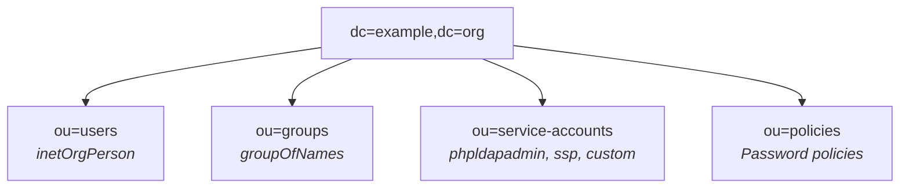

# OpenLDAP docker setup

A streamlined way to deploy an **[OpenLDAP](https://openldap.org/)** server along with **[phpLDAPadmin](https://github.com/leenooks/phpLDAPadmin)** and **[Self Service Password](https://github.com/ltb-project/self-service-password)** using Docker Compose. Built on the minimal [cleanstart/openldap](https://hub.docker.com/r/cleanstart/openldap) image (OpenLDAP 2.6).

Day-to-day directory administration is handled by the companion CLI **[openldap-cli](https://github.com/maximewewer/openldap-cli)**.

> Running on Kubernetes? See the Helm chart in [`../kubernetes/`](../kubernetes/).

---

## Table of contents

- [Overview](#overview)
  - [Key features](#key-features)
  - [Architecture](#architecture)
  - [Deployment modes](#deployment-modes)
- [Getting started](#getting-started)
  - [Prerequisites](#prerequisites)
  - [Quick start](#quick-start)
  - [Default credentials](#default-credentials)
- [Administration — openldap-cli](#administration--openldap-cli)
  - [Configure](#configure)
  - [Two-bind architecture](#two-bind-architecture)
  - [Day-1 sequence](#day-1-sequence)
  - [LDAP commands cheat-sheet](#ldap-commands-cheat-sheet)
- [Password rotation](#password-rotation)
- [TLS / LDAPS](#tls--ldaps)
  - [Enable TLS](#enable-tls)
  - [Certificate renewal](#certificate-renewal)
  - [HA: shared CA across nodes](#ha-shared-ca-across-nodes)
  - [Cron — automatic renewal](#cron--automatic-renewal)
- [Database storage & sizing](#database-storage--sizing)
  - [The 3 databases](#the-3-databases)
  - [Tuning the accesslog overlay](#tuning-the-accesslog-overlay)
  - [Monitoring](#monitoring)
  - [Resizing `olcDbMaxSize` at runtime](#resizing-olcdbmaxsize-at-runtime)
  - [Reclaiming disk space](#reclaiming-disk-space)
  - [Failure mode reference](#failure-mode-reference)
  - [HA notes](#ha-notes)
- [Backup & restore](#backup--restore)
  - [LDIF backup via openldap-cli (recommended)](#ldif-backup-via-openldap-cli-recommended)
  - [Physical snapshot via tar (offline)](#physical-snapshot-via-tar-offline)
  - [Cronjob](#cronjob)
- [Prometheus monitoring](#prometheus-monitoring)
- [POSIX support](#posix-support)
- [Password policy](#password-policy)
- [Integration examples](#integration-examples)

---

## Overview

### Key features

- **Minimal image**: Uses `cleanstart/openldap` — no shell, no bootstrap scripts, full control via `slapadd`
- **Secure by default**: Least-privilege ACLs per OU, SSHA-hashed rootDN passwords, ECDSA P-384 TLS certificates, isolated Docker network
- **Pre-configured overlays**: memberof, referential integrity, password policy, dynamic lists, accesslog (HA), syncprov (HA)
- **Three deployment modes**: standalone, HA active-passive (MirrorMode), HA active-active (N-way Multi-Master)
- **Vagrant-based HA test cluster**: boot 3 VMs to validate replication, failover, shared-CA TLS
- **Companion CLI**: [openldap-cli](https://github.com/maximewewer/openldap-cli) for users, groups, ppolicy, ACLs, diagnostics, backup
- **POSIX optional**: posixAccount/shadowAccount via opt-in schema flag

### Architecture

Directory Information Tree:



ACL matrix (least privilege) on the main database (`dc=example,dc=org`):

| Identity         | userPassword | service-accounts | users | groups | policies | base DN |
| ---------------- | ------------ | ---------------- | ----- | ------ | -------- | ------- |
| self             | write        | -                | write | -      | -        | -       |
| admin (ou=users) | write        | write            | write | write  | read     | write   |
| adminconfig      | -            | -                | read  | -      | -        | -       |
| ssp              | write        | -                | -     | -      | read     | -       |
| phpldapadmin     | -            | -                | read  | read   | read     | -       |
| anonymous        | auth only    | -                | -     | -      | read     | read    |

Infrastructure databases:

| Identity    | cn=config | cn=accesslog | cn=Monitor |
| ----------- | --------- | ------------ | ---------- |
| adminconfig | manage    | read         | read       |
| \*          | -         | -            | -          |

Apps that need read access to `ou=users` or `ou=groups` must use a dedicated service account (see [Integration examples](#integration-examples)).

### Deployment modes

Pick the layout that matches your availability needs. Each mode is **self-contained** in its own directory.

| Mode                  | Directory                                  | Topology                                               | Writes             | Read scaling      | Use when                           |
| --------------------- | ------------------------------------------ | ------------------------------------------------------ | ------------------ | ----------------- | ---------------------------------- |
| **Standalone**        | [`standalone/`](standalone/)               | 1 OpenLDAP container                                   | local only         | n/a               | dev / single-host prod             |
| **HA Active-Passive** | [`ha-active-passive/`](ha-active-passive/) | 2 masters (MirrorMode) + N consumers + HAProxy `first` | active master only | consumer replicas | clean failover, no conflict risk   |
| **HA Active-Active**  | [`ha-active-active/`](ha-active-active/)   | N masters (N-way Multi-Master) + HAProxy `roundrobin`  | any node           | any node          | max availability, write throughput |

Per-mode READMEs go into the specific operational details:

- [standalone/README.md](standalone/README.md)
- [ha-active-passive/README.md](ha-active-passive/README.md)
- [ha-active-active/README.md](ha-active-active/README.md)

---

## Getting started

### Prerequisites

- Docker & Docker Compose
- `ldap-utils` (only needed for raw `ldapsearch` debug; the CLI covers everything else)
- [openldap-cli](https://github.com/maximewewer/openldap-cli) — companion admin tool
- VirtualBox + Vagrant — HA modes only (for the local test cluster)

### Quick start

```bash
# Standalone (single host)
cd standalone && bash setup.sh

# HA Active-Passive — boot the 3-VM Vagrant cluster
cd ha-active-passive/tests && vagrant up

# HA Active-Active — boot the 3-VM Vagrant cluster
cd ha-active-active/tests && vagrant up
```

Each HA mode boots a 3-VM VirtualBox cluster on `192.168.58.10-12` running Docker + OpenLDAP 2.6 + HAProxy. Once provisioned, manage the directory with `openldap-cli` (see below).

### Default credentials

| Identity                     | DN                                                    | Password                             |
| ---------------------------- | ----------------------------------------------------- | ------------------------------------ |
| Admin user (subject to ACLs) | `cn=admin,ou=users,dc=example,dc=org`                 | `adminpassword`                      |
| Config admin (rootDN)        | `cn=adminconfig,cn=config`                            | `adminpasswordconfig`                |
| Data rootDN                  | `cn=admin,dc=example,dc=org`                          | (SSHA-hashed in `slapd-config.ldif`) |
| Replicator (HA only)         | `cn=replicator,ou=service-accounts,dc=example,dc=org` | `replicatorpassword`                 |

> **Change all defaults before production use.** See [Password rotation](#password-rotation).

---

## Administration — openldap-cli

Day-to-day directory administration (users, groups, service accounts, ppolicy, ACLs, diagnostics, backup) is handled by the companion CLI:

> **[github.com/maximewewer/openldap-cli](https://github.com/maximewewer/openldap-cli)** — a single static Go binary (no runtime, no dependencies).

This repo (`openldap-setup`) is now only responsible for **bootstrapping and operating the slapd container(s)** (compose, slapadd, TLS certs, HA replication wiring, physical backups).

### Configure

The CLI reads `~/.openldap-cli.yaml` (override with `--config PATH`). It supports multiple **profiles** — handy when switching between dev (standalone), HA staging, and prod nodes:

```yaml
default: prod
profiles:
  dev:
    url: ldap://localhost:389
    base_dn: dc=example,dc=org
    bind_dn: cn=admin,ou=users,dc=example,dc=org
    bind_pw: adminpassword
    config_bind_dn: cn=adminconfig,cn=config
    config_bind_pw: adminpasswordconfig
  prod:
    url: ldaps://ldap.example.org:636
    base_dn: dc=example,dc=org
    bind_dn: cn=admin-foo,ou=users,dc=example,dc=org
    bind_pw: ""              # prompt at runtime, or set LDAP_BIND_PW
    config_bind_dn: cn=adminconfig,cn=config
    config_bind_pw: ""
```

Env-var overrides (one-shot, scriptable): `LDAP_URL`, `LDAP_BASE_DN`, `LDAP_BIND_DN`, `LDAP_BIND_PW`, `LDAP_CONFIG_BIND_DN`, `LDAP_CONFIG_BIND_PW`, `LDAP_USER_OU`, `LDAP_GROUP_OU`, `LDAP_POLICY_OU`, `LDAP_MAIL_DOMAIN`, `LDAP_START_TLS`, `LDAP_INSECURE`.

Profile management:

```bash
openldap-cli profile list
openldap-cli profile current                      # passwords masked
openldap-cli profile use dev                      # persist default
openldap-cli --profile prod user info admin-foo   # one-off override
```

### Two-bind architecture

- **data bind** (`bind_dn`) — used for ACL-checked ops on `dc=…` (create/modify users, groups, etc.)
- **config bind** (`config_bind_dn`) — required for cn=config / ACL / overlay / monitor operations

> Full command list, flags, and JSON/YAML output modes:
> **[github.com/maximewewer/openldap-cli](https://github.com/maximewewer/openldap-cli)** — `openldap-cli <cmd> --help` from the binary itself.

### Day-1 sequence

After bootstrapping a deployment, the typical first-touch flow:

```bash
cd standalone && bash setup.sh                    # bootstrap (or HA equivalent)
openldap-cli --profile dev whoami                 # confirm bind
openldap-cli user passwd admin                    # rotate the default admin pwd
openldap-cli user add john.doe                    # onboard
openldap-cli group add-member demo john.doe
openldap-cli svc add gitea --subtree "ou=users,dc=example,dc=org" --access read
openldap-cli ops db-stats                         # sanity check
```

### LDAP commands cheat-sheet

`search` accepts an arbitrary `--base` — any subtree (including `cn=config`) is reachable without dropping to raw `ldapsearch`.

```bash
# List all entries under the base DN
openldap-cli search '(objectClass=*)' --base 'dc=example,dc=org'

# Overlays / databases / ACLs (cn=config bind)
openldap-cli config overlay list
openldap-cli config db list
openldap-cli config acl list 'olcDatabase={1}mdb,cn=config'

# Loaded modules (search on cn=config)
openldap-cli search '(objectClass=olcModuleList)' --base cn=config olcModuleLoad

# Test a service account's view (one-shot bind override via env)
LDAP_BIND_DN='cn=gitea,ou=service-accounts,dc=example,dc=org' LDAP_BIND_PW='PASSWORD' \
  openldap-cli search '(uid=john.doe)' --base 'ou=users,dc=example,dc=org'
```

---

## Password rotation

```bash
# User / service-account password — via the CLI
openldap-cli user passwd admin
openldap-cli svc passwd gitea

# RootDN passwords (cn=adminconfig,cn=config OR cn=admin,dc=example,dc=org)
# These live in slapd-config.ldif as {SSHA} hashes — rotate via config set:
HASH=$(docker run --rm --entrypoint slappasswd cleanstart/openldap:2.6.13 -s "NEW_PASSWORD")
openldap-cli config set 'olcDatabase={0}config,cn=config' olcRootPW "$HASH"
```

> After rotating any password, update the corresponding entry in your `~/.openldap-cli.yaml` profile (or the matching `LDAP_*` env var).

---

## TLS / LDAPS

`certs.sh` and `certs/` live inside each deployment mode (`standalone/`, `ha-active-active/`, `ha-active-passive/`).

### Enable TLS

1. **Generate certificates** (run from your mode directory):

   ```bash
   cd <mode>            # standalone | ha-active-active | ha-active-passive
   bash certs.sh
   ```

2. **Uncomment the TLS lines** in your mode's slapd-config (`init-config/slapd-config.ldif` for standalone, `init-config/slapd-config.ldif.tmpl` for HA), inside the `cn=config` entry:

   ```ldif
   olcTLSCACertificateFile: /etc/openldap/certs/openldapCA.crt
   olcTLSCertificateFile: /etc/openldap/certs/openldap.crt
   olcTLSCertificateKeyFile: /etc/openldap/certs/openldap.key
   olcTLSVerifyClient: never
   ```

3. **Uncomment the `command`** in `docker-compose.yml` to enable `ldaps://`:

   ```yaml
   command: ["slapd", "-d", "0", "-h", "ldap:// ldaps://", "-F", "/etc/openldap/slapd.d"]
   ```

4. **phpLDAPadmin over LDAPS** (standalone only — HA phpLDAPadmin points at HAProxy):

   ```yaml
   - LDAP_CONNECTION=ldaps
   - LDAP_PORT=636
   ```

5. **Test** (from inside your mode directory):

   ```bash
   # Via the CLI: temporarily target ldaps:// + trust the local CA
   LDAP_URL=ldaps://localhost:636 LDAPTLS_CACERT=./certs/openldapCA.crt \
     openldap-cli search '(objectClass=*)' --base 'dc=example,dc=org' -s base

   # Or raw, when you specifically want to inspect the TLS handshake itself:
   LDAPTLS_CACERT=./certs/openldapCA.crt ldapsearch -x -H ldaps://localhost:636 \
     -D "cn=admin,ou=users,dc=example,dc=org" -w "adminpassword" -b "dc=example,dc=org"
   ```

> **TLS at runtime**: if you enable TLS *after* the initial bootstrap (no `--reset`), you can inject the config live via the CLI:
>
> ```bash
> openldap-cli config set 'cn=config' olcTLSCACertificateFile /etc/openldap/certs/openldapCA.crt
> openldap-cli config set 'cn=config' olcTLSCertificateFile   /etc/openldap/certs/openldap.crt
> openldap-cli config set 'cn=config' olcTLSCertificateKeyFile /etc/openldap/certs/openldap.key
> ```

### Certificate renewal

`certs.sh` is idempotent and safe to run repeatedly:

- Generates the CA only when missing (or with `--regen-ca`)
- Renews the LDAP server cert only when missing, expired, or expiring within `--renew-threshold-days N` (default **30 days**)
- With `--restart`, restarts the `openldap` container when a cert is actually renewed (slapd reads TLS material at startup — no hot reload)
- HAProxy is **not** restarted: it does TCP passthrough, so cert renewal is transparent to it
- `--quiet` suppresses output when nothing happens (cron-friendly)

```bash
cd <mode>
bash certs.sh                                       # renew if expiring within 30 days
bash certs.sh --force                               # renew unconditionally
bash certs.sh --restart                             # renew and restart container if renewed
bash certs.sh --regen-ca                            # also regen the CA (rare)
bash certs.sh --renew-threshold-days 7              # tighter window
bash certs.sh --san "DNS:ldap1,IP:192.168.58.10"    # override SAN (HA: per-node)
bash certs.sh --help
```

### HA: shared CA across nodes

**Each peer must trust the same CA**, otherwise HAProxy failover causes a TLS mismatch (client sees a different CA after switching nodes). Workflow:

1. **CA master (node 1)** — generates the CA + its own server cert (SAN = node 1 hostname/IP).
2. **Each peer (node 2, 3, …)** — receives the CA's cert+key (scp or the Vagrant helper), then `certs.sh --ca-from PATH --san "..."` produces a per-node server cert signed by the shared CA.

Manual (production-ish):

```bash
# On node 1
cd /path/to/ha-active-active
bash certs.sh --san "DNS:ldap1,IP:192.168.58.10" --restart

# Copy CA cert+key to every peer (root-only files, treat carefully)
scp certs/openldapCA.{crt,key} root@192.168.58.11:/path/to/ha-active-active/certs/staging/
scp certs/openldapCA.{crt,key} root@192.168.58.12:/path/to/ha-active-active/certs/staging/

# On each peer (with its own SAN)
ssh root@192.168.58.11 "cd /path/to/ha-active-active && bash certs.sh --ca-from certs/staging --san 'DNS:ldap2,IP:192.168.58.11' --restart"
ssh root@192.168.58.12 "cd /path/to/ha-active-active && bash certs.sh --ca-from certs/staging --san 'DNS:ldap3,IP:192.168.58.12' --restart"
```

Vagrant test cluster (uses `vagrant ssh` to stream the CA between VMs):

```bash
cd ha-active-active/tests   # or ha-active-passive/tests
bash distribute-ca.sh        # bootstraps CA on ldap1, distributes to ldap2+ldap3,
                             # runs certs.sh per-node with the correct SAN, verifies chain
```

### Cron — automatic renewal

Replace `<mode>` with your deployment directory. On HA, install the cron on **every node** — the script reuses the existing CA and only renews the per-node server cert.

```cron
# Weekly check at 04:00 every Monday: renew if expiring within 30d, restart openldap if renewed.
# (HA peer example - keep --san per-node)
0 4 * * 1 cd /path/to/openldap-setup/<mode> && bash certs.sh --renew-threshold-days 30 --san "DNS:ldap2,IP:192.168.58.11" --restart --quiet >> /var/log/openldap-certs.log 2>&1
```

- `--quiet` keeps the log empty when no action is taken; only renewals/errors are recorded.
- Run the cron as **root** (or with passwordless sudo) — the script needs to `chown 101:102 certs/` so the openldap container can read the cert.
- Verify next expiry: `openssl x509 -in <mode>/certs/openldap.crt -enddate -noout`.
- **CA expiry** (3 years by default): plan a manual `--regen-ca` rotation campaign + re-distribution before that date.

---

## Database storage & sizing

This deployment uses **LMDB (back_mdb)** for every OpenLDAP database. LMDB pre-allocates its data file (`data.mdb`) to a fixed virtual size called the **mapsize** (`olcDbMaxSize`). The file is sparse — it only consumes real disk as data is written — but **no transaction can extend the file past the mapsize**: once reached you get `MDB_MAP_FULL` and every write fails until you raise the limit.

### The 3 databases

| DB          | suffix              | typical use                              | default `olcDbMaxSize` | typical growth                       |
| ----------- | ------------------- | ---------------------------------------- | ---------------------- | ------------------------------------ |
| `{0}config` | `cn=config`         | runtime config (modules, ACLs, overlays) | (small, hard-coded)    | none                                 |
| `{1}mdb`    | `dc=example,dc=org` | actual directory data                    | **1 GiB**              | slow (users, groups)                 |
| `{2}mdb`    | `cn=accesslog`      | overlay-written audit log                | **1 GiB**              | **fast** — every logged op = a write |

The accesslog DB is the one that **blows up** in practice. See below.

### Tuning the accesslog overlay

The `accesslog` overlay logs operations into `cn=accesslog`. Its growth rate is controlled by three attributes on `olcOverlay={N}accesslog,olcDatabase={1}mdb,cn=config`:

| Attribute             | Recommended value   | Effect                                                                                                                |
| --------------------- | ------------------- | --------------------------------------------------------------------------------------------------------------------- |
| `olcAccessLogOps`     | `writes`            | Audit only mutations (add/modify/delete). Add `bind` only if you need full auth audit — expect ~10× the volume.       |
| `olcAccessLogSuccess` | `TRUE`              | Log only successful operations. `FALSE` logs failures too — every retry, every bad-password bot floods the DB.        |
| `olcAccessLogPurge`   | `03+00:00 00+06:00` | Keep 3 days, purge every 6 hours. Default `07+00:00 01+00:00` (7d / 24h) lets the DB grow ~28× larger between purges. |

Example tuning (sane defaults for most deployments):

```bash
# Tighten purge: keep 3 days, sweep every 6 hours (live, no restart)
openldap-cli ops accesslog-purge --keep-days 3 --sweep 00+06:00

# Check what would be purged with a tighter window (read-only)
openldap-cli ops accesslog-purge --keep-days 1 --dry-run

# Or set the exact olcAccessLogPurge spec at once
openldap-cli ops accesslog-purge --set "03+00:00 00+06:00"

# Locate the accesslog overlay DN (the {N} index varies per deploy)
OVL_DN=$(openldap-cli config overlay list -o text | awk '/accesslog/ {print $1}' | head -1)

# Switch to success-only logging + drop bind logging
openldap-cli config set "$OVL_DN" olcAccessLogSuccess TRUE
openldap-cli config set "$OVL_DN" olcAccessLogOps writes
```

### Monitoring

```bash
# Per-DB MDB stats: entry count + page usage percentage + on-disk hints
openldap-cli ops db-stats

# Full cn=Monitor dump (connections, operations, threads, waiters)
openldap-cli ops monitor

# Mapsize (the hard limit) per DB
openldap-cli config db list

# Optional: physical file size on disk (sparse — can be much smaller than mapsize)
du -h <mode>/data/openldap-data/data.mdb
du -h <mode>/data/accesslog-data/data.mdb
```

Set up an alert when page usage from `ops db-stats` exceeds ~70%.

### Resizing `olcDbMaxSize` at runtime

`olcDbMaxSize` is **live-resizable** — slapd calls `mdb_env_set_mapsize()` and the new limit applies to the next transaction. No restart needed (and no `--reset`). Pick a value you can grow into for the next year.

The CLI ships a dedicated command that accepts human-readable sizes (`4GiB`, `512MiB`, or raw bytes):

```bash
# Bump cn=accesslog mapsize to 4 GiB (live)
openldap-cli config db resize 'olcDatabase={2}mdb,cn=config' 4GiB
```

> **Note**: the resize remaps the LMDB env, which can briefly disrupt slapd under heavy load — quiet hours preferred.
>
> **Cannot reduce live**: shrinking the mapsize requires `slapcat` → wipe `data.mdb` → `slapadd` offline.

### Reclaiming disk space

LMDB never shrinks `data.mdb` once allocated. Even after purges, the file size on disk stays the same (only internal free pages get reused). To physically reclaim:

```bash
# In a maintenance window (slapd OFF for that DB)
docker compose stop openldap
docker run --rm -v ./data:/data alpine sh -c '
  cd /data &&
  # dump the live accesslog DB to LDIF and wipe
  echo "Backup current: $(du -sh accesslog-data/data.mdb)"
  cp -r accesslog-data accesslog-data.bak
  rm -rf accesslog-data/*
'
# Optionally re-add the accesslog entries via slapadd -n 2 (or just let the overlay rebuild from now)
docker compose up -d openldap
```

For the main data DB (`{1}mdb`), the same flow with `slapcat -n 1` + `slapadd -n 1` keeps existing entries.

### Failure mode reference

When `data.mdb` is full you'll see in slapd logs:

```
mdb_id2entry_put: mdb_put failed: MDB_MAP_FULL: Environment mapsize limit reached(-30792)
mdb_add: txn_commit failed : MDB_MAP_FULL: Environment mapsize limit reached (-30792)
```

If `accesslog` is the saturated DB, **every write on the main DB also fails** (the accesslog overlay write is part of the same transaction). That cascades into surprising symptoms — the most common one being **all binds appearing to fail with "Invalid credentials"** because the `ppolicy` overlay can't write its `pwdFailureTime`/`pwdAccountLockedTime` counters.

### HA notes

Each node has its **own** accesslog DB (it's not replicated — it's a per-server transcript fed into delta-syncrepl). Tuning + monitoring must be applied **on every node**. Volume is approximately equal on all peers in steady state because each node logs both its own client writes and the writes it pulls in via syncrepl.

---

## Backup & restore

> Store backup files on an encrypted partition — they contain password hashes.

Two complementary approaches:

|                                    | LDIF (logical) — recommended             | tar (physical snapshot) — fallback       |
| ---------------------------------- | ---------------------------------------- | ---------------------------------------- |
| Tool                               | `openldap-cli backup` (online, via LDAP) | `tar` in alpine (offline, files on disk) |
| Portable across slapd versions     | yes                                      | no (MDB format tied to version)          |
| Server must be running             | yes                                      | no (best taken with slapd stopped)       |
| Captures runtime state (accesslog) | partial (data + config)                  | full (every byte of `data.mdb`)          |
| Restore granularity                | per-entry / subtree                      | all-or-nothing per DB                    |

For HA, run on **every node** independently (data is replicated, but accesslog is per-node).

### LDIF backup via openldap-cli (recommended)

The CLI takes a **positional file path** (auto-gzips when the suffix is `.gz`):

```bash
# Export the data tree (dc=…) as LDIF, gzipped
openldap-cli backup data backup/data_$(date +%Y%m%d).ldif.gz

# Export the cn=config tree (ACLs, overlays, schema, syncrepl…)
openldap-cli backup config backup/config_$(date +%Y%m%d).ldif.gz

# Restore (auto-detects gzip; reimports entries into the running server)
openldap-cli backup restore backup/data_YYYYMMDD.ldif.gz
```

For a full-fidelity dump (includes operational attrs `entryUUID`/`entryCSN`/`contextCSN`, not restorable but useful for forensic comparison), add `--operational`.

### Physical snapshot via tar (offline)

Useful when you want to clone a server byte-for-byte (e.g., move between hosts) or capture cn=accesslog state including indexes. Requires `cd <mode>` first.

```bash
cd <mode>

# Config / data / accesslog snapshots (slapd can be running — MDB is crash-safe,
# but a stopped slapd gives a guaranteed-consistent snapshot)
docker run --rm -v ./data/slapd.d:/slapd.d:ro -v ./backup:/backup alpine:latest \
  sh -c "tar czf /backup/config_$(date +%Y%m%d).tar.gz -C /slapd.d ."
docker run --rm -v ./data/openldap-data:/data:ro -v ./backup:/backup alpine:latest \
  sh -c "tar czf /backup/data_$(date +%Y%m%d).tar.gz -C /data ."
docker run --rm -v ./data/accesslog-data:/data:ro -v ./backup:/backup alpine:latest \
  sh -c "tar czf /backup/accesslog_$(date +%Y%m%d).tar.gz -C /data ."

# Restore: stop slapd, wipe, extract, fix perms, restart
docker compose down
docker run --rm -v ./data:/data alpine:latest \
  sh -c "rm -rf /data/slapd.d/* /data/openldap-data/* /data/accesslog-data/*"
docker run --rm -v ./data/slapd.d:/slapd.d        -v ./backup:/backup alpine:latest sh -c "tar xzf /backup/config_DATE.tar.gz -C /slapd.d"
docker run --rm -v ./data/openldap-data:/data     -v ./backup:/backup alpine:latest sh -c "tar xzf /backup/data_DATE.tar.gz -C /data"
docker run --rm -v ./data/accesslog-data:/data    -v ./backup:/backup alpine:latest sh -c "tar xzf /backup/accesslog_DATE.tar.gz -C /data"
docker run --rm -v ./data/slapd.d:/slapd.d -v ./data/openldap-data:/data -v ./data/accesslog-data:/alog alpine:latest \
  sh -c "chown -R 101:102 /slapd.d /data /alog"
docker compose up -d
```

### Cronjob

```bash
# LDIF backup via CLI — recommended (no docker, no root, no slapd restart)
# Positional file path; .ldif.gz auto-gzips the dump.
0 22 * * * /usr/bin/openldap-cli backup data /path/to/openldap-setup/<mode>/backup/data_$(date +\%Y\%m\%d).ldif.gz 2>>/var/log/openldap-backup.log
0 22 * * * /usr/bin/openldap-cli backup config /path/to/openldap-setup/<mode>/backup/config_$(date +\%Y\%m\%d).ldif.gz 2>>/var/log/openldap-backup.log

# Retention: drop LDIF + tarballs older than 30 days
0 23 * * * find /path/to/openldap-setup/<mode>/backup -type f \( -name "*.tar.gz" -o -name "*.ldif" -o -name "*.ldif.gz" \) -mtime +30 -delete
```

---

## Prometheus monitoring

The `back_monitor` module is enabled in `slapd-config.ldif`. It exposes server statistics via `cn=Monitor` (connections, operations, threads, MDB pages, etc.), queryable directly via the CLI:

```bash
openldap-cli ops monitor                # full cn=Monitor dump
openldap-cli ops db-stats               # focused on back_mdb (entries, pages, % used)
openldap-cli ops replication            # local contextCSN per database
```

To expose these metrics to Prometheus, use the [OpenLDAP Prometheus Exporter](https://github.com/maximewewer/openldap_prometheus_exporter). It connects to `cn=Monitor` and serves metrics on an HTTP endpoint for Prometheus scraping.

---

## POSIX support

POSIX attributes (`posixAccount`, `shadowAccount`, `uidNumber`, `gidNumber`, `homeDirectory`, `loginShell`) are **disabled by default**.

To enable POSIX support, uncomment these lines in your mode's slapd-config (`standalone/init-config/slapd-config.ldif` or `<ha-mode>/init-config/slapd-config.ldif.tmpl`) **before running the bootstrap** (`standalone/setup.sh` or `<ha-mode>/setup-node.sh`):

```ldif
# Schema
#include: file:///etc/openldap/schema/nis.ldif

# Index
#olcDbIndex: uidNumber,gidNumber eq

# ACL (insert as {1}, shift subsequent indexes)
#olcAccess: {1}to attrs=shadowLastChange by self write by * read
```

Once the schema is enabled, create POSIX users via the CLI — see `openldap-cli user add --help` for the available flags.

---

## Password policy

The default password policy (`cn=defaultppolicy,ou=policies`) enforces:

| Rule                       | Value                   |
| -------------------------- | ----------------------- |
| Minimum length             | 16 characters           |
| Quality check              | Enabled                 |
| Max age                    | 365 days                |
| Expiry warning             | 7 days before           |
| History                    | 5 passwords             |
| Lockout after              | 3 failed attempts       |
| Lockout duration           | 30 minutes              |
| Must change on first login | Yes                     |
| Cleartext passwords        | Auto-hashed server-side |

Manage policies via the CLI (`openldap-cli ppolicy set/assign/list/show/delete`).

---

## Integration examples

Create a dedicated service account instead of using the admin account:

```bash
openldap-cli svc add myapp --access read --subtree "ou=users,dc=example,dc=org"
```

Then configure your application (Zitadel, Gitea, Nextcloud, etc.) with:

| Setting           | Value                                            |
| ----------------- | ------------------------------------------------ |
| Server            | `ldap://IP_or_FQDN:389`                          |
| Base DN           | `dc=example,dc=org`                              |
| Bind DN           | `cn=myapp,ou=service-accounts,dc=example,dc=org` |
| Bind Password     | _(returned by `svc add`)_                        |
| User filter       | `(uid=%s)`                                       |
| User object class | `inetOrgPerson`                                  |
| ID attribute      | `uid`                                            |
| Display name      | `displayName`                                    |
| Email             | `mail`                                           |
| First name        | `givenName`                                      |
| Last name         | `sn`                                             |
