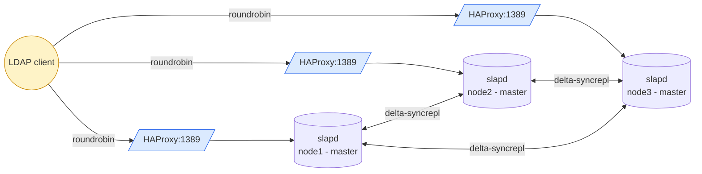

# HA Active-Active — N-way Multi-Master

OpenLDAP cluster where **every node accepts writes**. Replication is delta-syncrepl mesh: each peer pulls from each other peer's accesslog. Writes converge via `entryCSN` (timestamp + serverID).

> See [OpenLDAP Admin Guide — Replication](https://www.openldap.org/doc/admin26/replication.html).

## Topology (3 nodes)



- HAProxy on each VM: **`balance roundrobin`** (all peers are equal, all accept writes)
- `olcMirrorMode: TRUE` on every node
- Conflicts resolved by `entryCSN`. Apps requiring strict ordering should route writes to a single node.

## Quick start (Vagrant — 3 VMs)

The 3-VM test cluster lives under [`tests/`](tests/):

```bash
cd tests
vagrant up                                                      # boot cluster
./test-replication.sh \
  ldap://192.168.58.10 ldap://192.168.58.11 ldap://192.168.58.12
vagrant destroy -f                                              # tear down
```

| VM    | IP             | Notes |
|-------|----------------|-------|
| ldap1 | 192.168.58.10  | master + phpLDAPadmin enabled |
| ldap2 | 192.168.58.11  | master |
| ldap3 | 192.168.58.12  | master |

## Manual setup (no Vagrant)

On each VM (Docker required):

```bash
cd ha-active-active
cp .env.example .env
# Edit SERVER_ID (1, 2, 3...) and NODE_URIS (all peer LDAP URIs, including self)
./setup-node.sh
```

Always start node 1 first — peers need it to load the initial dataset.

## Per-VM ports

| Port  | Service |
|-------|---------|
| 389   | OpenLDAP (peer↔peer replication + direct client access) |
| 636   | OpenLDAP TLS |
| 1389  | HAProxy LDAP frontend (client-facing, roundrobin LB) |
| 1636  | HAProxy LDAPS frontend |
| 8404  | HAProxy stats UI (admin/admin) |
| 8080  | phpLDAPadmin (node 1 only via `--profile ui` / `ENABLE_PHPLDAPADMIN=true`) |

## Files

User-facing (deploy these on your real hosts):

| Path | Purpose |
|------|---------|
| `docker-compose.yml` | openldap + haproxy + (phpldapadmin) |
| `setup-node.sh` | per-node bootstrap (renders config, slapadd, starts compose) |
| `init-config/slapd-config.ldif.tmpl` | cn=config template (multimaster syncrepl placeholders) |
| `haproxy/haproxy.cfg.tmpl` | HAProxy template (roundrobin hardcoded) |
| `.env.example` | Per-node config template (SERVER_ID, NODE_URIS, ...) |

Test scaffolding (under `tests/`):

| Path | Purpose |
|------|---------|
| `tests/Vagrantfile` | 3-VM cluster definition |
| `tests/provision.sh` | Vagrant provisioner: install Docker + run setup-node.sh |
| `tests/test-replication.sh` | Write probe + cross-peer convergence check |
| `tests/distribute-ca.sh` | Bootstrap shared CA on ldap1, distribute to ldap2+ldap3, generate per-node certs |

Local data: `init-ldifs/replicator.ldif` (HA-only service account).
Local TLS material: `certs.sh` + `certs/` (idempotent renewal — see root README for cron). Backup dumps: `backup/`. Pulls from `../base-ldifs/` (shared directory data).

## Database sizing (per node)

Each node has its **own** `cn=accesslog` DB — not replicated, fed by the local accesslog overlay. The default `olcDbMaxSize: 1 GiB` will saturate fast under high bind volume, causing `MDB_MAP_FULL` and cascading bind failures (ppolicy can't update its counters). Tune `olcAccessLogOps` / `olcAccessLogSuccess` / `olcAccessLogPurge` **on every node**, and live-resize `olcDbMaxSize` if needed (no restart required). See [root README — Database storage & sizing](../README.md#database-storage--sizing) for the full procedure and monitoring queries.
