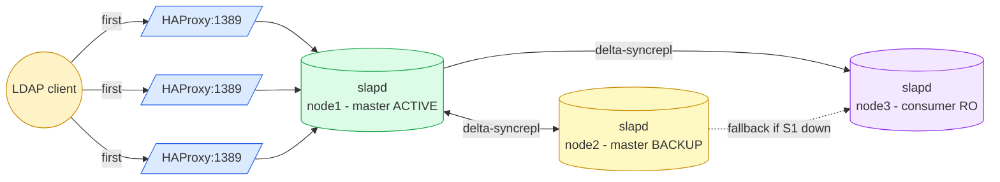

# HA Active-Passive — MirrorMode

OpenLDAP cluster with **two MirrorMode masters** (one active, one hot standby) plus optional **read-only consumers** for scale-out reads. HAProxy uses `balance first` so writes go to the primary master; on failure they switch to the backup master.

> See [OpenLDAP Admin Guide — Replication](https://www.openldap.org/doc/admin26/replication.html).

## Topology (3 nodes)



- Nodes 1 & 2: masters with `olcMirrorMode: TRUE`. HAProxy serves node 1 to clients; node 2 receives traffic only when node 1 is DOWN.
- Node 3 (and any `SERVER_ID >= 3`): pure read-only consumer. Writes are rejected (`Server unwilling to perform — shadow context`).
- Failover detection latency: HAProxy `inter=5s rise=2 fall=3` → DOWN after ~15s.

## Quick start (Vagrant — 3 VMs)

The 3-VM test cluster lives under [`tests/`](tests/):

```bash
cd tests
vagrant up
./test-replication.sh \
  ldap://192.168.58.10 ldap://192.168.58.11 ldap://192.168.58.12
vagrant destroy -f
```

### Failover test

```bash
# Stop the active master
vagrant ssh ldap1 -c 'sudo docker stop openldap'

# Wait for HAProxy to mark node1 DOWN (~15-20s), then write via any node's HAProxy
sleep 20
ldapadd -x -H ldap://192.168.58.11:1389 -D cn=admin,dc=example,dc=org -w adminpassword <<EOF
dn: cn=failover-test,ou=users,dc=example,dc=org
objectClass: inetOrgPerson
cn: failover-test
sn: t
EOF

# Restore primary - syncrepl back-syncs the entry from ldap2
vagrant ssh ldap1 -c 'sudo docker start openldap'
```

## VM roles

| VM    | IP             | Role       | Writes accepted? |
|-------|----------------|------------|------------------|
| ldap1 | 192.168.58.10  | master (active)  | yes (primary) |
| ldap2 | 192.168.58.11  | master (backup)  | yes (when promoted) |
| ldap3 | 192.168.58.12  | consumer (read-only) | **no** (shadow) |

## Manual setup

```bash
cd ha-active-passive
cp .env.example .env  # set SERVER_ID and NODE_URIS
./setup-node.sh
```

## Per-VM ports

Same as active-active. HAProxy uses `balance first` instead of `roundrobin`.

## Files

User-facing (deploy these on your real hosts):

| Path | Purpose |
|------|---------|
| `docker-compose.yml` | openldap + haproxy + (phpldapadmin) |
| `setup-node.sh` | Role-aware bootstrap (master if SERVER_ID ≤ 2, else consumer) |
| `init-config/slapd-config.ldif.tmpl` | cn=config template (mirror placeholders) |
| `haproxy/haproxy.cfg.tmpl` | HAProxy template (`balance first` hardcoded, node1 active, node2+ backup) |
| `.env.example` | Per-node config template |

Test scaffolding (under `tests/`):

| Path | Purpose |
|------|---------|
| `tests/Vagrantfile` | 3-VM cluster definition |
| `tests/provision.sh` | Vagrant provisioner |
| `tests/test-replication.sh` | Write probe (also detects consumer rejection) |
| `tests/distribute-ca.sh` | Bootstrap shared CA on ldap1, distribute to ldap2+ldap3, generate per-node certs |

Local data: `init-ldifs/replicator.ldif` (HA-only service account).
Local TLS material: `certs.sh` + `certs/` (idempotent renewal — see root README for cron). Backup dumps: `backup/`. Pulls from `../base-ldifs/` (shared directory data).

## Caveats

- HAProxy `balance first` requires the active master to be detected DOWN before switching; momentary connection failures during the ~15s detection window are normal.
- For a true VIP failover (sub-second), add keepalived in front (out of scope here).
- Consumer nodes (`SERVER_ID >= 3`) can be added/removed without affecting the master pair.
