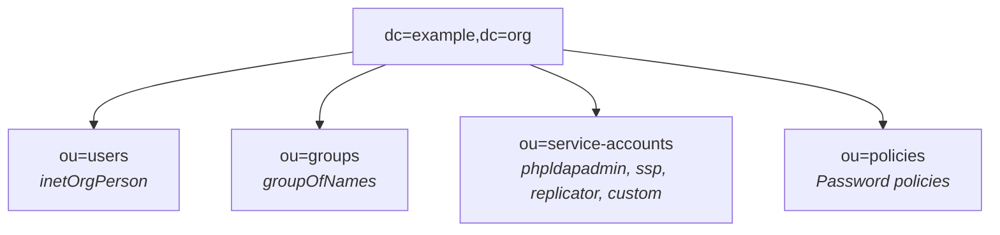
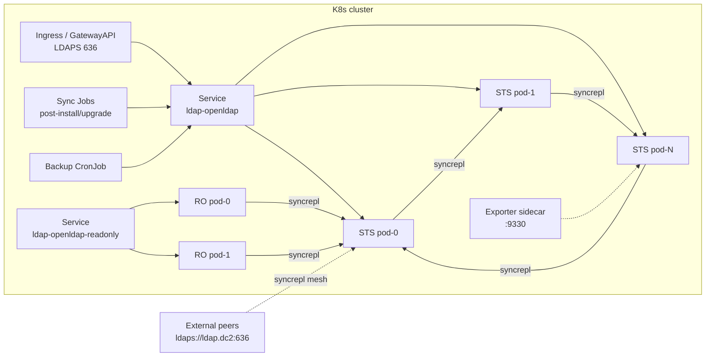

# OpenLDAP Kubernetes setup

A production-oriented Helm chart to deploy an **[OpenLDAP](https://openldap.org/)** server along with **[phpLDAPadmin](https://github.com/leenooks/phpLDAPadmin)** and **[Self Service Password](https://github.com/ltb-project/self-service-password)** on Kubernetes. Built on the minimal [cleanstart/openldap](https://hub.docker.com/r/cleanstart/openldap) image (OpenLDAP 2.6).

Day-to-day directory administration is handled by the companion CLI **[openldap-cli](https://github.com/maximewewer/openldap-cli)** — invoked from sync Jobs on `helm upgrade`, and available for ad-hoc use inside the release namespace.

> Running on Docker Compose? See the sibling recipes in [`../docker/`](../docker/).

---

## Table of contents

- [Overview](#overview)
  - [Key features](#key-features)
  - [Architecture](#architecture)
  - [Deployment modes](#deployment-modes)
- [Getting started](#getting-started)
  - [Prerequisites](#prerequisites)
  - [Quick start](#quick-start)
  - [Default credentials](#default-credentials)
- [Administration — openldap-cli](#administration--openldap-cli)
  - [Declarative flow (sync Jobs)](#declarative-flow-sync-jobs)
  - [Ad-hoc CLI use](#ad-hoc-cli-use)
- [Password rotation](#password-rotation)
- [TLS / LDAPS](#tls--ldaps)
  - [`cert-manager` backend](#cert-manager-backend)
  - [`job` backend (in-cluster CA)](#job-backend-in-cluster-ca)
  - [`provided` backend](#provided-backend)
  - [Ingress (LDAPS only)](#ingress-ldaps-only)
- [Database storage & sizing](#database-storage--sizing)
- [Backup & restore](#backup--restore)
- [Prometheus monitoring](#prometheus-monitoring)
- [POSIX support](#posix-support)
- [Password policy](#password-policy)
- [Hardening](#hardening)
- [Integration examples](#integration-examples)
  - [Argo CD](#argo-cd)
  - [Flux](#flux)
  - [Cross-cluster HA](#cross-cluster-ha)
- [Detailed docs](#detailed-docs)

---

## Overview

### Key features

- **Minimal runtime image**: `cleanstart/openldap:2.6.13` (distroless, no shell). Alpine sidecars only for bootstrap/renew/sync operations.
- **Three deployment modes**: `standalone`, `mirror` (active/passive), `multi-master` (N-way delta-syncrepl), plus optional `readOnlyReplicas` for read-heavy fan-out.
- **Cross-cluster HA**: `replication.externalPeers` + distinct `serverIdBase` per cluster; runbook + Vagrant test rig included.
- **Declarative administration**: `openldap.users`, `openldap.groups`, `openldap.policies` reconciled on every `helm upgrade` via post-install Jobs driving `openldap-cli`.
- **Password Secret backend**: per-user passwords auto-generated, stored in per-user Secrets (never in `values.yaml`), preserved across upgrades via lookup + resource-policy keep.
- **Three TLS backends**: `cert-manager` Certificate CR, in-cluster `job` (self-signed CA + weekly renew CronJob + rolling restart), or user-`provided` Secret.
- **Ingress**: `ingress-nginx` SSL passthrough OR Gateway API `TLSRoute` — both for LDAPS.
- **Backup + accesslog purge**: daily `openldap-cli backup` + weekly `openldap-cli ops accesslog-purge` CronJobs.
- **Prometheus monitoring**: sidecar [openldap_prometheus_exporter](https://github.com/maximewewer/openldap_prometheus_exporter) + `ServiceMonitor` + baseline `PrometheusRule`.
- **Hardened by default**: non-root, drop-all caps, read-only rootfs, seccomp `RuntimeDefault`, auto-PDB in HA, NetworkPolicy scoped to server pods.
- **Extension points**: `extraEnv`, `extraVolumes`/`Mounts`, `sidecars`, `extraInitContainers`, `extraDeploy` on every subchart.
- **Custom bootstrap**: `customSchemas.files`/`existingConfigMap`, `customLdifs.files`/`existingConfigMap`, `customAcls` / `extraAcls` — extend the tree without forking.
- **GitOps-ready**: reference Argo CD + Flux manifests; Helm hooks + `lookup` pattern documented.

### Architecture

Directory Information Tree (identical to the Docker layouts — same LDIF pipeline):



ACL matrix on the main database (`dc=example,dc=org`) — chart defaults, overridable via `customAcls` (replace) or `extraAcls` (append):

| Identity                        | userPassword | subtree (`dc=…`)         | ou=policies |
| ------------------------------- | ------------ | ------------------------ | ----------- |
| self                            | write        | -                        | -           |
| `admin` rootDN                  | write        | write                    | write       |
| `replicator` (HA only)          | read         | read                     | read        |
| authenticated users             | auth (via `by users read`) | read                     | read        |
| anonymous                       | auth only    | -                        | read        |

Infrastructure databases (`cn=config`, `cn=accesslog`, `cn=Monitor`) — restricted to `cn=adminconfig,cn=config`, plus read for the Prometheus exporter sidecar.

Kubernetes topology (writable pool + optional read-only pool):



### Deployment modes

Pick the layout that matches your availability + read/write ratio. `mode` is a values knob; the chart enforces the matching `replicaCount` and emits fail-fast validation on mismatch.

| Mode              | Replicas | Write pool           | Read pool                            | Use when                             |
| ----------------- | -------- | -------------------- | ------------------------------------ | ------------------------------------ |
| `standalone`      | 1        | 1                    | same pod                             | dev, single-pod prod, PoC            |
| `mirror`          | 2        | 2 (active/passive)   | either pod                           | HA with clean failover, no conflicts |
| `multi-master`    | N ≥ 2    | any pod (mesh)       | any pod                              | active/active writes, max throughput |
| `+ readOnlyReplicas.count > 0` | RW + RO | RW pool only         | dedicated RO pool (`olcReadOnly=TRUE`) | read-heavy workloads (auth traffic)  |

Cross-cluster HA (any of the modes above, multi-cluster mesh): set
`replication.externalPeers` + distinct `serverIdBase` per cluster. See
[Integration examples → Cross-cluster HA](#cross-cluster-ha).

---

## Getting started

### Prerequisites

- Kubernetes ≥ 1.27 (Gateway API TLSRoute needs 1.25+; the chart uses `v1` + `v1alpha2`).
- Helm ≥ 3.13 (chart uses `lookup`, `fromJsonArray`, `toJson`).
- A `StorageClass` for `ReadWriteOnce` PVCs (one per replica).
- Optional dependencies — only when the matching feature is enabled:
  - **cert-manager** ≥ 1.14 — for `tls.backend: cert-manager`
  - **prometheus-operator** — for `monitoring.serviceMonitor.enabled` / `prometheusRule.enabled`
  - **ingress-nginx** ≥ 1.10 with `--enable-ssl-passthrough` — for `ingress.mode: ingress-nginx`
  - **Gateway API** — for `ingress.mode: gateway-api` (Cilium 1.15, Istio 1.22 tested)
  - **external-secrets** ≥ 0.9 — for `existingSecret` fields backed by Vault/AWS SM/…
  - **Calico / Cilium / kube-router** — for `NetworkPolicy` enforcement (minikube's default CNI is a no-op)

Full matrix: [`docs/compatibility.md`](docs/compatibility.md).

### Quick start

```bash
# Standalone (single pod, no TLS, no ingress)
helm upgrade --install ldap kubernetes/charts/openldap-stack \
  --namespace ldap --create-namespace

# 3-way multi-master HA + phpLDAPadmin + SSP
helm upgrade --install ldap kubernetes/charts/openldap-stack \
  --namespace ldap --create-namespace \
  --set openldap.mode=multi-master --set openldap.replicaCount=3 \
  --set phpldapadmin.enabled=true \
  --set self-service-password.enabled=true

# Cross-cluster HA — see kubernetes/tests/cross-cluster/ for a Vagrant rig
```

Ready-made overlays (dev PoC, small prod, multi-DC, GitOps): [`docs/recipes.md`](docs/recipes.md).

### Default credentials

Admin + config-admin + replicator + per-user passwords are **auto-generated on first install** and stored in Kubernetes Secrets. Retrieve them with `kubectl`:

| Identity                                    | Secret                                    | Key                       | DN                                                                    |
| ------------------------------------------- | ----------------------------------------- | ------------------------- | --------------------------------------------------------------------- |
| Admin (data rootDN)                         | `<release>-openldap-admin`                | `admin-password`          | `cn=admin,dc=example,dc=org`                                          |
| Config admin (cn=config rootDN)             | `<release>-openldap-admin`                | `config-admin-password`   | `cn=adminconfig,cn=config`                                            |
| Replicator (HA only)                        | `<release>-openldap-replicator`           | `replicator-password`     | `cn=replicator,ou=service-accounts,dc=example,dc=org`                 |
| Per-user (created by users sync Job)        | `<release>-openldap-user-<uid>`           | `password`                | `cn=<uid>,ou=users,dc=example,dc=org`                                 |
| phpLDAPadmin `APP_KEY`                      | `<release>-phpldapadmin-app-key`          | `app-key`                 | (Laravel session key)                                                 |
| SSP token keyphrase                         | `<release>-self-service-password-keyphrase` | `keyphrase`             | (token HMAC secret)                                                   |

```bash
kubectl -n ldap get secret ldap-openldap-admin \
  -o jsonpath='{.data.admin-password}' | base64 -d ; echo
```

> All Secrets carry `helm.sh/resource-policy: keep` — they survive `helm uninstall`, so re-installing the same release name preserves credentials. Override any of them by setting the matching `existingSecret` value (see [Ad-hoc CLI use](#ad-hoc-cli-use) and each subchart's `values.yaml`).

---

## Administration — openldap-cli

Two flows: **declarative** (`values.yaml` reconciled by sync Jobs on every upgrade) and **ad-hoc** (run the CLI locally against port-forward or the ingress).

### Declarative flow (sync Jobs)

`openldap.users`, `openldap.groups` and `openldap.policies` are the source of truth for the directory content. On every `helm install/upgrade`, three post-install/upgrade Jobs run in order (weights 5 / 10 / 15) and drive [openldap-cli](https://github.com/maximewewer/openldap-cli) against the LDAP Service:

- **`ppolicy`** — `openldap-cli ppolicy set <name> [--min-length …]` idempotent create/update.
- **`users`** — `openldap-cli user info` → `user add` (with generated pw + Secret) OR `user set` for drift; on removal, `user delete` or `user set pwdAccountLockedTime` depending on `onUserRemove`.
- **`groups`** — `openldap-cli group create/add-member/remove-member` reconciling `members` against LDAP.

```yaml
openldap:
  policies:
    - cn: strong
      min-length: 12
      max-age: 7776000     # 90d
      max-failure: 5
      lockout: true
  users:
    - uid: alice
      givenName: Alice
      sn: Wonderland
      mail: alice@example.org
      policy: strong             # optional — triggers `ppolicy assign`
      attrs:                     # optional — free-form extra `user set`
        title: Engineer
  groups:
    - cn: devs
      description: Development team
      members: [alice, bob]      # UIDs
  onUserRemove: delete           # or `lock` — pwdAccountLockedTime instead
  onGroupRemove: delete
```

Passwords per user land in `<release>-openldap-user-<uid>`. Attribute changes reconcile on every upgrade. Group membership is expressed on the group side; the `memberOf` overlay auto-populates the user entry.

The sync Jobs install `openldap-cli` + `kubectl` from GitHub / dl.k8s.io into a plain Alpine image at Job startup — no custom image build required. Their ServiceAccount is scoped strictly to Secret CRUD (and `statefulsets/patch` when TLS renewal needs a rolling restart) in the release namespace.

### Ad-hoc CLI use

For one-off inspection or emergency ops, install [openldap-cli](https://github.com/maximewewer/openldap-cli) locally and point it at a `kubectl port-forward`:

```bash
kubectl -n ldap port-forward svc/ldap-openldap 389:389 &

cat > ~/.openldap-cli.yaml <<'YAML'
default: k8s-dev
profiles:
  k8s-dev:
    url: ldap://localhost:389
    base_dn: dc=example,dc=org
    bind_dn: cn=admin,dc=example,dc=org
    bind_pw: ""         # populate via env: LDAP_BIND_PW=$(kubectl get secret …)
    config_bind_dn: cn=adminconfig,cn=config
    config_bind_pw: ""
YAML

LDAP_BIND_PW=$(kubectl -n ldap get secret ldap-openldap-admin -o jsonpath='{.data.admin-password}' | base64 -d) \
LDAP_CONFIG_BIND_PW=$(kubectl -n ldap get secret ldap-openldap-admin -o jsonpath='{.data.config-admin-password}' | base64 -d) \
openldap-cli ops db-stats
```

Full CLI command reference: see [Docker README → Administration](../docker/README.md#administration--openldap-cli) — same binary, same commands.

---

## Password rotation

Chart-managed passwords survive `helm uninstall` (annotated `helm.sh/resource-policy: keep`). To rotate:

```bash
# 1. Delete the Secret you want to rotate — chart re-generates a fresh
#    random on the next `helm upgrade` (via the lookup + fallback pattern).
kubectl -n ldap delete secret ldap-openldap-admin

# 2. Trigger a re-render.
helm upgrade ldap kubernetes/charts/openldap-stack -n ldap --reuse-values

# 3. Roll the StatefulSet so slapd picks up the new hash on next bind.
kubectl -n ldap rollout restart statefulset/ldap-openldap
```

For per-user passwords:

```bash
kubectl -n ldap delete secret ldap-openldap-user-alice
helm upgrade ldap kubernetes/charts/openldap-stack -n ldap --reuse-values
#   sync Job re-detects alice, generates a fresh password, writes it back
#   to the Secret (and via `openldap-cli user passwd` into the tree).
```

For externally-managed Secrets (`admin.existingSecret`, `replication.replicator.existingSecret`, per-user `existingSecret`), rotate the source Secret via your Secret Manager / external-secrets; the chart re-reads it on next reconciliation.

---

## TLS / LDAPS

`openldap.tls.enabled: true` mounts a Secret with `ca.crt` + `tls.crt` + `tls.key` at `/etc/openldap/certs` and enables LDAPS on port 636 (plus StartTLS on 389). Three interchangeable backends:

### `cert-manager` backend

Chart emits a `Certificate` CR pointing at your issuer. SANs default to the per-pod DNS names + `ingress.host`; extend with `certManager.dnsNames`.

```yaml
openldap:
  tls:
    enabled: true
    backend: cert-manager
    certManager:
      issuerRef: { name: internal-ca, kind: ClusterIssuer }
      duration: 8760h            # 1 year
      renewBefore: 720h          # 30 days
      dnsNames: [ldap.example.com]
```

### `job` backend (in-cluster CA)

No external dependency. A pre-install Helm hook Job generates a self-signed CA + server cert into `<release>-openldap-tls`. A weekly CronJob calls `openssl x509 -checkend` and regenerates within `renewThresholdDays`; on renewal, the StatefulSet is rolled so pods pick up the new cert without downtime.

```yaml
openldap:
  tls:
    enabled: true
    backend: job
    job:
      caValidityDays: 3650
      certValidityDays: 365
      renewThresholdDays: 30
      schedule: "0 4 * * 1"
      commonName: openldap
      subjectAltNames: [ldap.example.com]
      rollingRestartOnRenew: true
```

### `provided` backend

Bring your own Secret (populated by Vault, external-secrets, or manually). Required keys: `ca.crt`, `tls.crt`, `tls.key`.

```yaml
openldap:
  tls:
    enabled: true
    backend: provided
    provided:
      secretName: my-tls-secret
```

**Syncrepl over TLS** — `replication.startTLS: "yes|critical"` + `replication.tlsReqcert: never|allow|try|demand` control the handshake on each `olcSyncRepl` entry. Quote `"yes"` — YAML 1.1 parses bare `yes` as boolean.

### Ingress (LDAPS only)

`openldap.ingress.enabled: true` publishes LDAPS externally. Requires `tls.enabled: true` — both modes rely on SNI passthrough.

```yaml
openldap:
  ingress:
    enabled: true
    mode: ingress-nginx           # or `gateway-api`
    host: ldap.example.com
    ingressNginx:
      className: nginx            # controller MUST run --enable-ssl-passthrough
    # OR:
    gatewayAPI:
      gatewayClassName: cilium    # provisions Gateway + TLSRoute
      port: 636
```

Plaintext LDAP (389) is not routed via Ingress — use a `LoadBalancer` or `NodePort` Service if you need it externally.

---

## Database storage & sizing

Every replica gets one PVC with three subPath mounts (`slapd.d/`, `openldap-data/`, `accesslog-data/`). LMDB is copy-on-write and grows sparsely up to `olcDbMaxSize` — set high, pay only for what's used.

```yaml
openldap:
  persistence:
    enabled: true
    storageClass: ""              # cluster default
    size: 10Gi                    # per replica
  database:
    main:
      maxSizeBytes: 4294967296    # 4 GiB — bump for >100k entries
    accesslog:
      maxSizeBytes: 4294967296    # 4 GiB — #1 prod incident source
  accesslog:
    ops: "writes"                 # drop `bind` on high-traffic setups
    logSuccess: false
    purge: "03+00:00 00+06:00"    # sweep every 3 h, keep 6 h
```

**`MDB_MAP_FULL` live-fix recipe** (no downtime — `mdb_env_set_mapsize` is applied on next transaction):

```bash
kubectl -n ldap exec ldap-openldap-0 -c openldap -- \
  ldapmodify -x -H ldap://localhost:389 \
    -D cn=adminconfig,cn=config -w "$CFG_PW" <<EOF
dn: olcDatabase={2}mdb,cn=config
changetype: modify
replace: olcDbMaxSize
olcDbMaxSize: 4294967296
EOF
# Then bump values.yaml + helm upgrade for durability.
```

Full sizing formulas + CPU/memory targets + accesslog math: [`docs/sizing.md`](docs/sizing.md).

---

## Backup & restore

`openldap.backup.enabled: true` schedules a daily CronJob that dumps data + config as gzipped LDIF via `openldap-cli backup`, stores them on a chart-managed PVC (or an existing one via `persistence.existingClaim`), and prunes files older than `retentionDays`.

```yaml
openldap:
  backup:
    enabled: true
    schedule: "0 22 * * *"        # every night at 22:00
    retentionDays: 30
    persistence:
      size: 20Gi
    includeOperational: true      # pass --operational to backup data
```

Weekly MDB reclaim (slapd's built-in `olcAccessLogPurge` deletes entries but doesn't reclaim MDB pages):

```yaml
openldap:
  accesslogPurgeJob:
    enabled: true
    schedule: "0 3 * * 0"         # Sundays 03:00
    keepDays: 7
    sweep: "00+06:00"
```

Restore flow (fresh install → import dump → optionally re-enable sync Jobs): [`docs/backup-restore.md`](docs/backup-restore.md).

---

## Prometheus monitoring

`openldap.monitoring.enabled: true` adds a sidecar [openldap_prometheus_exporter](https://github.com/maximewewer/openldap_prometheus_exporter) to every StatefulSet pod, publishes port `9330` on the LDAP Service, and optionally emits a `ServiceMonitor` + `PrometheusRule` for prometheus-operator installs.

```yaml
openldap:
  monitoring:
    enabled: true
    exporter:
      extraEnv:
        - { name: OPENLDAP_METRICS_EXCLUDE, value: "sasl,log" }
    serviceMonitor:
      enabled: true
      interval: 30s
      labels: { release: kube-prometheus-stack }
    prometheusRule:
      enabled: true
```

Baseline alerts shipped with `prometheusRule.enabled=true`:

| Alert                             | Trigger                                            |
| --------------------------------- | -------------------------------------------------- |
| `OpenLDAPDown`                    | `openldap_up == 0` for 3 min                       |
| `OpenLDAPScrapeErrors`            | `openldap_scrape_errors_total` increases > 5 / 10 min |
| `OpenLDAPTLSCertExpiringSoon`     | cert expiry < 30 days                              |
| `OpenLDAPReplicationLagHigh`      | peer lag > 60 s for 10 min                         |
| `OpenLDAPAccountLockouts`         | lockout events > 3 in 5 min                        |

Exporter binds as `cn=adminconfig,cn=config` (config-admin has the `cn=Monitor` read ACL seeded by bootstrap); its password is mounted from `<release>-openldap-admin` via `LDAP_PASSWORD_FILE`.

---

## POSIX support

Add `nis` to `openldap.directory.schemas` to load the POSIX schema (`uidNumber`, `gidNumber`, `homeDirectory`, `loginShell`, `shadow*`) — required for SSH / UNIX login backed by LDAP. The chart auto-adds a matching `olcDbIndex: uidNumber,gidNumber eq` on the main mdb.

```yaml
openldap:
  directory:
    schemas: [cosine, inetorgperson, dyngroup, nis]
  # Now `openldap.users` entries can carry `objectClass: posixAccount` in
  # their `attrs` map, or push posix entries via `customLdifs`.
```

---

## Password policy

Managed declaratively via `openldap.policies` (reconciled by the `ppolicy` sync Job). Every key maps 1:1 to a `openldap-cli ppolicy set` flag:

```yaml
openldap:
  ppolicy:
    enabled: true
    defaultPolicyRDN: cn=defaultppolicy    # under ou=policies,<suffix>
    hashCleartext: true
  policies:
    - cn: defaultppolicy
      min-length: 12
      max-age: 7776000                     # 90 days
      expire-warning: 604800               # 7 days
      in-history: 5
      max-failure: 5
      lockout-duration: 1800               # 30 min
      lockout: true
      check-quality: 2
      must-change: false
  users:
    - uid: alice
      policy: defaultppolicy               # triggers `ppolicy assign`
```

---

## Hardening

Chart defaults are strict; every knob below is on out-of-the-box:

- **`runAsNonRoot: true`** at pod level (uid 101 / gid 102 for slapd; 65532 for the exporter). Init containers that need `apk add` run as root but drop every capability except `CHOWN, FOWNER, DAC_OVERRIDE`.
- **`readOnlyRootFilesystem: true`** on slapd + exporter (mutable state on PVC subPaths and a memory-backed `/run/openldap`).
- **`capabilities.drop: [ALL]`**; slapd adds only `NET_BIND_SERVICE` for the privileged ports.
- **`seccompProfile: RuntimeDefault`** at pod level.
- **`automountServiceAccountToken: false`** on the server SA (only sync/tls Jobs mount their token).
- **PodDisruptionBudget** — `podDisruptionBudget.enabled: auto` emits `minAvailable: replicas - 1` in HA modes and skips in standalone.
- **NetworkPolicy** — `networkPolicy.enabled: true` emits a default-deny scoped to `app.kubernetes.io/component: server` (and a matching one for the readonly pool) with explicit allows for peer syncrepl, sync/backup/tls Jobs, Prometheus scrape, and external LDAPS peers.
- **PodSecurityAdmission** — label the release namespace `pod-security.kubernetes.io/enforce=restricted`; every pod the chart emits already satisfies `restricted`.

```bash
kubectl label ns ldap \
  pod-security.kubernetes.io/enforce=restricted \
  pod-security.kubernetes.io/enforce-version=latest
```

---

## Integration examples

### Argo CD

Reference `Application` manifest at [`gitops/argocd/application.yaml`](gitops/argocd/application.yaml). Key points:

- Chart source from Git — Argo resolves `file://` subchart deps transparently.
- Set `syncOptions: [CreateNamespace=true, ServerSideApply=true, RespectIgnoreDifferences=true]`.
- Add `ignoreDifferences` on chart-managed Secrets — the `lookup` pattern makes them drift by design in dry-runs.
- **Never** enable wildcard prune on Secrets marked `helm.sh/resource-policy: keep` — you'd rotate every credential silently.

App-of-apps for multi-env (dev/stage/prod): [`gitops/argocd/app-of-apps.yaml`](gitops/argocd/app-of-apps.yaml).

### Flux

Reference `GitRepository` + `HelmRelease` at [`gitops/flux/`](gitops/flux/). Both `install` and `upgrade` remediation are enabled so Helm hooks (`tls-init` pre-install, `sync-*` post-install/upgrade) get retried on transient failures. Pull sensitive values from external Secrets via `valuesFrom`.

### Cross-cluster HA

Every peer needs an outside-reachable LDAP(S) endpoint (see [Ingress](#ingress-ldaps-only)). Set `openldap.replication.externalPeers` to the FQDNs of nodes in the other cluster(s), and pick a distinct `serverIdBase` per cluster so `olcServerID` stays globally unique:

```yaml
# dc1 (seed cluster)
openldap:
  mode: multi-master
  replicaCount: 3
  replication:
    serverIdBase: 1                       # IDs 1, 2, 3
    seedOnOrdinalZeroOnly: true
    externalPeers: [ldaps://ldap.dc2.example.com:636]

# dc2 (joining cluster)
openldap:
  mode: multi-master
  replicaCount: 3
  replication:
    serverIdBase: 10                      # IDs 10, 11, 12
    seedOnOrdinalZeroOnly: false          # pull tree from dc1 via syncrepl
    externalPeers: [ldaps://ldap.dc1.example.com:636]
```

Full bootstrap runbook: [`cross-cluster/README.md`](cross-cluster/README.md).
2-VM Vagrant + minikube test rig: [`tests/cross-cluster/`](tests/cross-cluster/).

---

## Detailed docs

Operator handbook — task-oriented, deep-dive:

| Doc                                        | When to open                                                        |
| ------------------------------------------ | ------------------------------------------------------------------- |
| [`docs/recipes.md`](docs/recipes.md)                       | Copy-paste values overlays per shape (dev, small prod, multi-DC, GitOps, ExternalSecret) |
| [`docs/troubleshooting.md`](docs/troubleshooting.md)       | 23 real failure modes with the exact `kubectl` diagnostic + fix     |
| [`docs/upgrade-uninstall.md`](docs/upgrade-uninstall.md)   | Rolling upgrade, rollback caveats, keep-vs-prune Secrets, purge script |
| [`docs/backup-restore.md`](docs/backup-restore.md)         | DR playbook, full-restore recipe, HA-aware restore                  |
| [`docs/sizing.md`](docs/sizing.md)                         | CPU/mem/storage/mapsize formulas + MAP_FULL live-fix recipe         |
| [`docs/migrate-from-docker.md`](docs/migrate-from-docker.md) | Move an existing `../docker/` deployment to the chart                |
| [`docs/values-reference.md`](docs/values-reference.md)     | Curated top-30 values + pointer to auto-generated per-chart READMEs |
| [`docs/compatibility.md`](docs/compatibility.md)           | K8s / Helm / CNI / optional-dep version matrix                      |
| [`gitops/README.md`](gitops/README.md)                     | Argo CD + Flux integration (Helm hooks, Secret preservation, SSA)   |
| [`cross-cluster/README.md`](cross-cluster/README.md)       | Multi-cluster HA bootstrap runbook (prereqs, seed order, CA rotation) |
| [`tests/cross-cluster/README.md`](tests/cross-cluster/README.md) | 2-VM Vagrant + minikube rig (validate cross-cluster HA locally)  |

Chart-native reference (auto-generated from `values.yaml` via `helm-docs`):

- Umbrella: [`charts/openldap-stack/README.md`](charts/openldap-stack/README.md)
- Subchart `openldap`: [`charts/openldap-stack/charts/openldap/README.md`](charts/openldap-stack/charts/openldap/README.md)
- Subchart `phpldapadmin`: [`charts/openldap-stack/charts/phpldapadmin/README.md`](charts/openldap-stack/charts/phpldapadmin/README.md)
- Subchart `self-service-password`: [`charts/openldap-stack/charts/self-service-password/README.md`](charts/openldap-stack/charts/self-service-password/README.md)

Regenerate the auto-docs: `cd kubernetes && make docs` (checked in CI via `make docs-check`).
